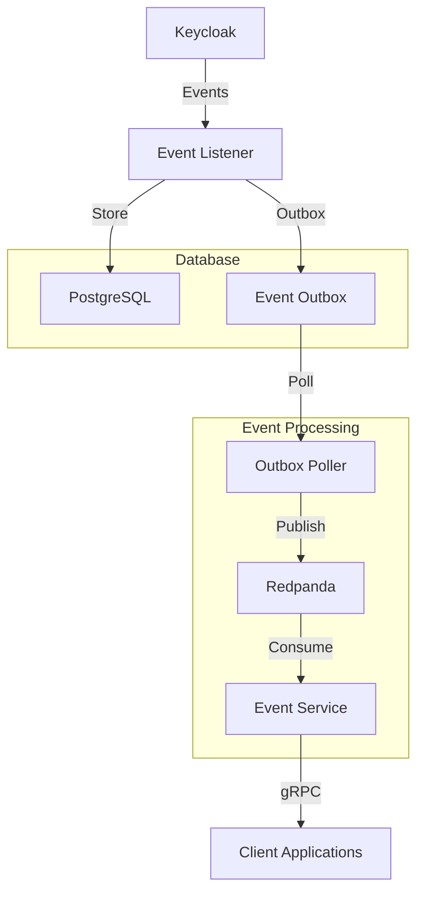
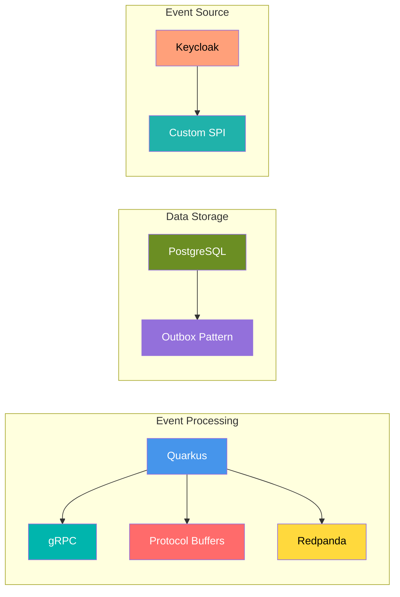
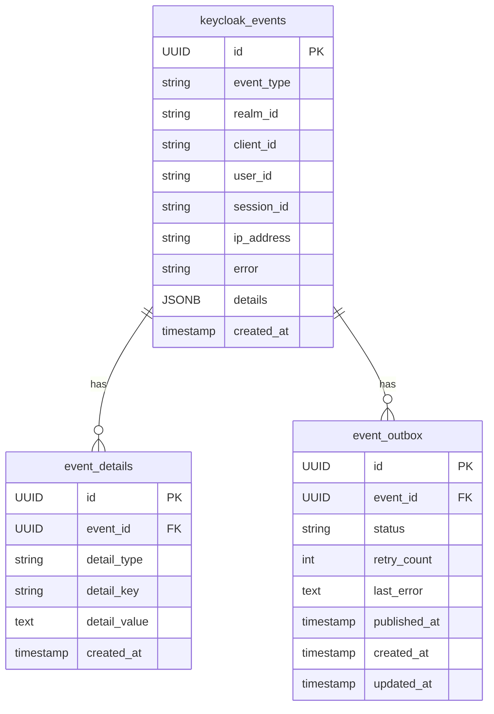
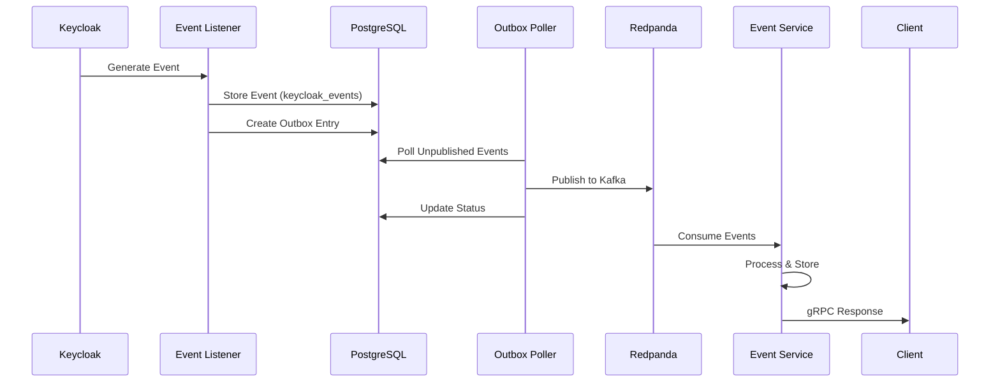
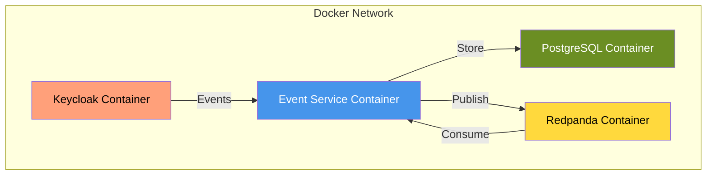
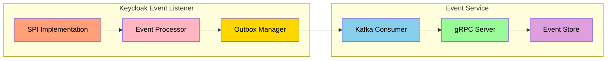
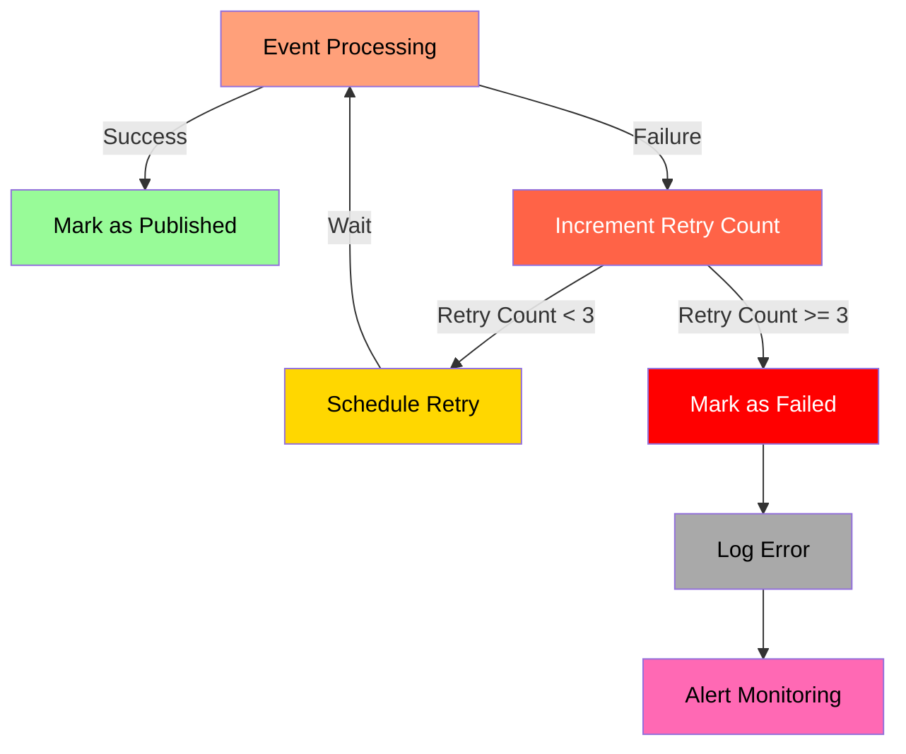
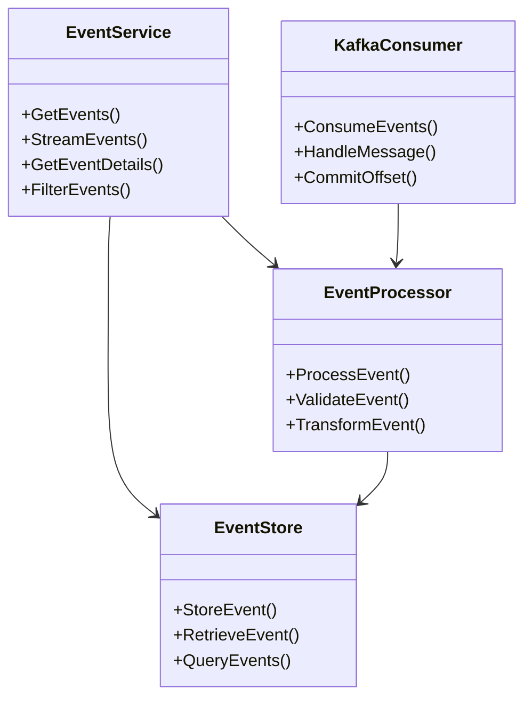

# SmartFace Keycloak Event System

This project implements a robust event handling system for Keycloak using the Outbox Pattern. It ensures reliable event delivery from Keycloak to Kafka while maintaining data consistency.

## System Architecture



The system consists of the following components:

1. **Keycloak Event Listener**
   - Captures events from Keycloak using a custom SPI (Service Provider Interface)
   - Implements the `EventListenerProvider` interface to receive Keycloak events
   - Uses a transactional approach to ensure data consistency
   - Handles various event types (LOGIN, LOGOUT, REGISTER, etc.)

2. **Outbox Pattern Implementation**
   - **Event Storage**: Events are first stored in the `keycloak_events` table
   - **Outbox Table**: The `event_outbox` table tracks events pending Kafka publication
   - **Publishing Process**:
     - Events are written to both tables in a single transaction
     - Outbox poller periodically checks for unpublished events
     - Events are published to Kafka and marked as published
     - Failed events are retried with exponential backoff
   - **Exactly-Once Delivery**: Ensures each event is published exactly once to Kafka

3. **Event Service**
   - Consumes events from Kafka using a reactive consumer
   - Provides gRPC interface for event queries and streaming
   - Implements event filtering and pagination
   - Maintains event history and metadata

## Technology Stack



### Redpanda (Kafka-compatible)
- **Why Redpanda?**
  - High-performance, Kafka-compatible streaming platform
  - Lower latency and higher throughput compared to traditional Kafka
  - Simplified deployment and management
  - Built-in schema registry and REST proxy
  - Perfect for event streaming and real-time data processing

### gRPC and Protocol Buffers
- **Why gRPC?**
  - High-performance RPC framework
  - Strongly typed API contracts using Protocol Buffers
  - Efficient binary serialization
  - Support for streaming and bidirectional communication
  - Automatic code generation for multiple languages
  - Perfect for microservices communication

### Quarkus
- **Why Quarkus?**
  - Supersonic Subatomic Java framework
  - Fast startup time and low memory footprint
  - Native compilation support
  - Reactive programming model
  - Extensive extension ecosystem
  - Developer-friendly with live coding
  - Perfect for cloud-native applications

### Protocol Buffers
- **Why Protocol Buffers?**
  - Efficient data serialization
  - Language-neutral data format
  - Backward and forward compatibility
  - Automatic code generation
  - Smaller payload size compared to JSON
  - Perfect for high-performance communication

## Database Schema



The `event_details` table serves as a flexible extension to the main `keycloak_events` table:
- Stores additional metadata and context for events
- Supports multiple detail types per event
- Allows for structured key-value pairs
- Maintains referential integrity with the main events table
- Enables efficient querying of specific event details

## Event Flow



## Error Handling and Recovery

- **Retry Mechanism**:
  - Failed events are retried up to 3 times
  - Exponential backoff between retries
  - Error details are stored in the outbox table

- **Consistency Guarantees**:
  - Transactional event storage
  - Idempotent event processing
  - Exactly-once delivery to Kafka

- **Monitoring and Debugging**:
  - Event status tracking in outbox table
  - Error logging and metrics
  - Manual retry capability for failed events

## Setup and Running

1. **Prerequisites**
   - Docker and Docker Compose
   - Java 17 or later
   - Maven

2. **Environment Variables**
   ```bash
   KC_EVENTS_LISTENER_KAFKA_BOOTSTRAP_SERVERS=redpanda:29092
   KC_EVENTS_LISTENER_KAFKA_TOPIC=keycloak_events
   KC_EVENTS_LISTENER_KAFKA_CLIENT_ID=keycloak-event-listener
   KC_EVENTS_LISTENER_DB_URL=jdbc:postgresql://postgres:5432/keycloak
   KC_EVENTS_LISTENER_DB_USER=keycloak
   KC_EVENTS_LISTENER_DB_PASSWORD=password
   ```

3. **Building and Running**
   ```bash
   # Build the event listener
   cd keycloak-kafka-event-listener
   mvn clean package

   # Start all services
   docker compose up -d --build
   ```

4. **Verifying the Setup**
   - Check Keycloak logs: `docker logs smartface-keycloak-1`
   - Check event service logs: `docker logs smartface-event-service-1`
   - Monitor Kafka topics: `docker exec -it smartface-redpanda-1 rpk topic list`

## Monitoring and Maintenance

- **Event Status Monitoring**:
  ```sql
  SELECT status, COUNT(*) 
  FROM event_outbox 
  GROUP BY status;
  ```

- **Error Tracking**:
  ```sql
  SELECT event_id, retry_count, last_error 
  FROM event_outbox 
  WHERE status = 'FAILED';
  ```

- **Performance Metrics**:
  - Event processing latency
  - Kafka publishing success rate
  - Database transaction metrics

## Troubleshooting

1. **Event Not Published**
   - Check outbox table for failed events
   - Verify Kafka connectivity
   - Review error logs in Keycloak

2. **High Latency**
   - Monitor database performance
   - Check Kafka consumer lag
   - Review outbox poller configuration

3. **Data Inconsistency**
   - Verify transaction boundaries
   - Check for duplicate events
   - Review error handling logic

## Development

1. **Building the Event Listener**
   ```bash
   cd keycloak-kafka-event-listener
   mvn clean package
   ```

2. **Building the Event Service**
   ```bash
   cd keycloak-event-service
   mvn clean package
   ```

3. **Testing**
   - Unit tests: `mvn test`
   - Integration tests: `mvn verify`
   - Manual testing: Use Keycloak admin console to trigger events

## Kubernetes Deployment

### Prerequisites
- Kubernetes cluster (v1.20 or later)
- kubectl configured
- Helm (optional, for easier deployment)

### Deployment Manifests

1. **Namespace**
```yaml
apiVersion: v1
kind: Namespace
metadata:
  name: smartface
```

2. **ConfigMap**
```yaml
apiVersion: v1
kind: ConfigMap
metadata:
  name: smartface-config
  namespace: smartface
data:
  KC_EVENTS_LISTENER_KAFKA_BOOTSTRAP_SERVERS: "redpanda:29092"
  KC_EVENTS_LISTENER_KAFKA_TOPIC: "keycloak_events"
  KC_EVENTS_LISTENER_KAFKA_CLIENT_ID: "keycloak-event-listener"
  KC_EVENTS_LISTENER_DB_URL: "jdbc:postgresql://postgres:5432/keycloak"
  KC_EVENTS_LISTENER_DB_USER: "keycloak"
  KC_EVENTS_LISTENER_DB_PASSWORD: "password"
```

3. **Event Service Deployment**
```yaml
apiVersion: apps/v1
kind: Deployment
metadata:
  name: event-service
  namespace: smartface
spec:
  replicas: 2
  selector:
    matchLabels:
      app: event-service
  template:
    metadata:
      labels:
        app: event-service
    spec:
      containers:
      - name: event-service
        image: smartface-event-service:latest
        ports:
        - containerPort: 8080
        - containerPort: 9000  # gRPC port
        envFrom:
        - configMapRef:
            name: smartface-config
        resources:
          requests:
            memory: "512Mi"
            cpu: "500m"
          limits:
            memory: "1Gi"
            cpu: "1000m"
        readinessProbe:
          httpGet:
            path: /q/health/ready
            port: 8080
        livenessProbe:
          httpGet:
            path: /q/health/live
            port: 8080
```

4. **Event Service Service**
```yaml
apiVersion: v1
kind: Service
metadata:
  name: event-service
  namespace: smartface
spec:
  selector:
    app: event-service
  ports:
  - name: http
    port: 8080
    targetPort: 8080
  - name: grpc
    port: 9000
    targetPort: 9000
  type: ClusterIP
```

5. **Keycloak Deployment**
```yaml
apiVersion: apps/v1
kind: Deployment
metadata:
  name: keycloak
  namespace: smartface
spec:
  replicas: 1
  selector:
    matchLabels:
      app: keycloak
  template:
    metadata:
      labels:
        app: keycloak
    spec:
      containers:
      - name: keycloak
        image: quay.io/keycloak/keycloak:latest
        ports:
        - containerPort: 8080
        env:
        - name: KEYCLOAK_ADMIN
          value: "admin"
        - name: KEYCLOAK_ADMIN_PASSWORD
          value: "admin"
        - name: KC_PROXY
          value: "edge"
        - name: KC_HOSTNAME_STRICT
          value: "false"
        - name: KC_DB
          value: "postgres"
        - name: KC_DB_URL
          value: "jdbc:postgresql://postgres:5432/keycloak"
        - name: KC_DB_USERNAME
          value: "keycloak"
        - name: KC_DB_PASSWORD
          value: "password"
        resources:
          requests:
            memory: "1Gi"
            cpu: "500m"
          limits:
            memory: "2Gi"
            cpu: "1000m"
```

6. **Keycloak Service**
```yaml
apiVersion: v1
kind: Service
metadata:
  name: keycloak
  namespace: smartface
spec:
  selector:
    app: keycloak
  ports:
  - port: 8080
    targetPort: 8080
  type: ClusterIP
```

7. **PostgreSQL StatefulSet**
```yaml
apiVersion: apps/v1
kind: StatefulSet
metadata:
  name: postgres
  namespace: smartface
spec:
  serviceName: postgres
  replicas: 1
  selector:
    matchLabels:
      app: postgres
  template:
    metadata:
      labels:
        app: postgres
    spec:
      containers:
      - name: postgres
        image: postgres:14
        ports:
        - containerPort: 5432
        env:
        - name: POSTGRES_USER
          value: "keycloak"
        - name: POSTGRES_PASSWORD
          value: "password"
        - name: POSTGRES_DB
          value: "keycloak"
        volumeMounts:
        - name: postgres-data
          mountPath: /var/lib/postgresql/data
        resources:
          requests:
            memory: "1Gi"
            cpu: "500m"
          limits:
            memory: "2Gi"
            cpu: "1000m"
  volumeClaimTemplates:
  - metadata:
      name: postgres-data
    spec:
      accessModes: [ "ReadWriteOnce" ]
      resources:
        requests:
          storage: 10Gi
```

8. **Redpanda StatefulSet**
```yaml
apiVersion: apps/v1
kind: StatefulSet
metadata:
  name: redpanda
  namespace: smartface
spec:
  serviceName: redpanda
  replicas: 1
  selector:
    matchLabels:
      app: redpanda
  template:
    metadata:
      labels:
        app: redpanda
    spec:
      containers:
      - name: redpanda
        image: vectorized/redpanda:latest
        ports:
        - containerPort: 9092
          name: kafka
        - containerPort: 8081
          name: admin
        command:
        - /bin/bash
        - -c
        - |
          /usr/bin/rpk redpanda start \
            --node-id 0 \
            --kafka-addr 0.0.0.0:9092 \
            --advertise-kafka-addr redpanda:9092 \
            --smp 1 \
            --memory 1G \
            --overprovisioned \
            --node-id 0
        resources:
          requests:
            memory: "1Gi"
            cpu: "500m"
          limits:
            memory: "2Gi"
            cpu: "1000m"
```

### Deployment Steps

1. **Create Namespace**
```bash
kubectl apply -f namespace.yaml
```

2. **Create ConfigMap**
```bash
kubectl apply -f configmap.yaml
```

3. **Deploy PostgreSQL**
```bash
kubectl apply -f postgres.yaml
```

4. **Deploy Redpanda**
```bash
kubectl apply -f redpanda.yaml
```

5. **Deploy Keycloak**
```bash
kubectl apply -f keycloak.yaml
```

6. **Deploy Event Service**
```bash
kubectl apply -f event-service.yaml
```

### Helm Chart (Alternative)

For easier deployment, you can use the Helm chart:

1. **Create Chart**
```bash
helm create smartface
```

2. **Install Chart**
```bash
helm install smartface ./smartface
```

### Monitoring and Scaling

1. **Horizontal Pod Autoscaling**
```yaml
apiVersion: autoscaling/v2
kind: HorizontalPodAutoscaler
metadata:
  name: event-service
  namespace: smartface
spec:
  scaleTargetRef:
    apiVersion: apps/v1
    kind: Deployment
    name: event-service
  minReplicas: 2
  maxReplicas: 5
  metrics:
  - type: Resource
    resource:
      name: cpu
      target:
        type: Utilization
        averageUtilization: 70
```

2. **Monitoring Setup**
```yaml
apiVersion: monitoring.coreos.com/v1
kind: ServiceMonitor
metadata:
  name: event-service
  namespace: smartface
spec:
  selector:
    matchLabels:
      app: event-service
  endpoints:
  - port: http
    path: /q/metrics
```

### Backup and Recovery

1. **PostgreSQL Backup**
```yaml
apiVersion: batch/v1
kind: CronJob
metadata:
  name: postgres-backup
  namespace: smartface
spec:
  schedule: "0 0 * * *"
  jobTemplate:
    spec:
      template:
        spec:
          containers:
          - name: backup
            image: postgres:14
            command:
            - /bin/sh
            - -c
            - |
              pg_dump -h postgres -U keycloak keycloak > /backup/backup.sql
            volumeMounts:
            - name: backup-volume
              mountPath: /backup
            env:
            - name: PGPASSWORD
              valueFrom:
                secretKeyRef:
                  name: postgres-secret
                  key: password
          volumes:
          - name: backup-volume
            persistentVolumeClaim:
              claimName: backup-pvc
          restartPolicy: OnFailure
```

### Security Considerations

1. **Network Policies**
```yaml
apiVersion: networking.k8s.io/v1
kind: NetworkPolicy
metadata:
  name: event-service-policy
  namespace: smartface
spec:
  podSelector:
    matchLabels:
      app: event-service
  ingress:
  - from:
    - podSelector:
        matchLabels:
          app: keycloak
    ports:
    - protocol: TCP
      port: 8080
```

2. **Secrets Management**
```yaml
apiVersion: v1
kind: Secret
metadata:
  name: postgres-secret
  namespace: smartface
type: Opaque
data:
  password: base64_encoded_password
```

## Contributing

1. Fork the repository
2. Create a feature branch
3. Commit your changes
4. Push to the branch
5. Create a Pull Request

## License

This project is licensed under the MIT License - see the LICENSE file for details.

## Deployment Architecture



## Component Interaction



## Data Flow Details

```mermaid
flowchart LR
    subgraph "Event Capture"
        A[Keycloak Event] --> B[Event Listener]
        B --> C[Event Validator]
        C --> D[Event Transformer]
    end
    
    subgraph "Event Storage"
        D --> E[Database Transaction]
        E --> F[Event Tables]
    end
    
    subgraph "Event Publishing"
        F --> G[Outbox Poller]
        G --> H[Kafka Producer]
        H --> I[Redpanda]
    end
    
    subgraph "Event Consumption"
        I --> J[Kafka Consumer]
        J --> K[Event Processor]
        K --> L[gRPC Service]
    end
    
    style A fill:#FFA07A,color:black
    style B fill:#FFB6C1,color:black
    style C fill:#FFD700,color:black
    style D fill:#87CEEB,color:black
    style E fill:#98FB98,color:black
    style F fill:#DDA0DD,color:black
    style G fill:#FF6347,color:white
    style H fill:#4682B4,color:white
    style I fill:#FFD700,color:black
    style J fill:#32CD32,color:black
    style K fill:#9370DB,color:white
    style L fill:#FF69B4,color:black
```



## Error Handling Flow



## gRPC Service Architecture

